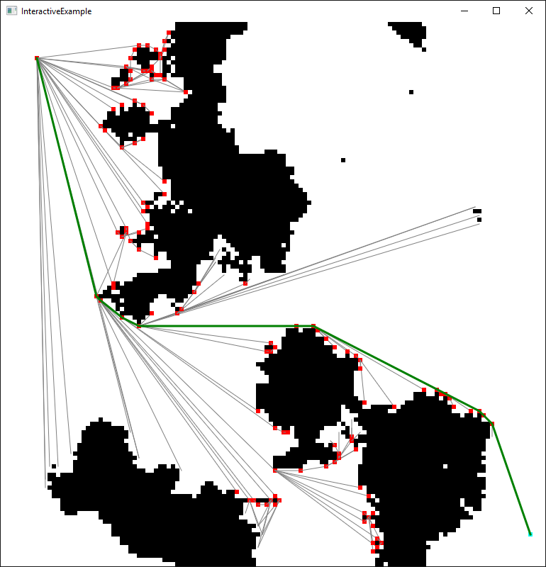

pathfinding
==============

Implementation of the A* algorithm on a visibility graph to find the shortest any-angle path in a 2D grid.
Optimized to minimize the number of line-of-sight checks.

Grids can be loaded from files or generated using the diamond-square algorithm.

